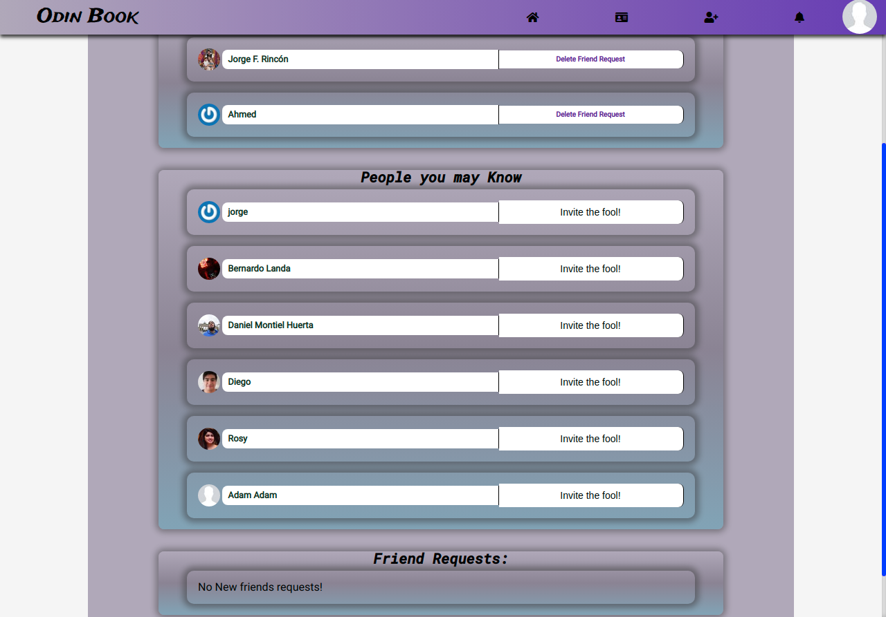
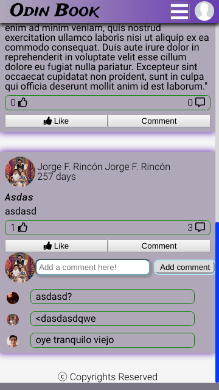

# 💻 Odin Book (BETA)

<h2 align="center">Web View</h2>
<p align="center">

</p>
<h2 align="center">Mobile View</h2>
<p align="center">

</p>

- **Odin Facebook** is a mini blog that allows users to publish new posts about a variety of topics.

### Technologies Used

In this app we used the following technologies:

HTML | CSS(SASS) | Ruby | Rails 
------------ | ------------- | ----------- | -----------
 |  |  | 

# Entity Relationship diagram


## ✨ Live Demo

You can look at it [here](https://desolate-badlands-67931.herokuapp.com)

## 🚀 Getting Started

To get a local copy up and running follow these simple example steps.

### Clone

```sh
git git@github.com:stratospherique/odin-facebook.git
cd odin-facebook
```

### Install

```sh
bundle install
```

### Usage (ENV==Dev)

```sh
rails s
```

## Tests (Models + controllers + views)
```sh
rspec
```

## Author

:male_detective: Ahmed Mahfoudh

- [Github](https://github.com/stratospherique)
- [Linkedin](https://www.linkedin.com/in/ahmed-mahfoudh/)
- [Twitter](https://twitter.com/AhmedMahfoudh8)
- [Email](mailto:ahmed.mahfoudh1991@gmail.com?subject=Website%20Inquiry)

👤 **Jorge Fernando Rincón Figueroa**

- Github: [@jofer86](https://github.com/jofer86)
- Twitter: [@JoferDev](https://twitter.com/JoferDev)
- Linkedin: [in/fernando-rincon-figueroa/](https://www.linkedin.com/in/fernando-rincon-figueroa/)

## 🤝 Contributing

Contributions, issues and feature requests are welcome!

Feel free to check the [issues page](issues/).

## Show your support

Give a ⭐️ if you like this project!

> “There is no exercise better for the heart than reaching down and lifting people up.” 
John Holmes